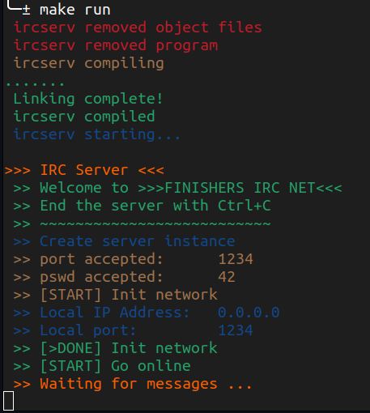

<!-- ahokcool HEADER START-->
---
<a id="top"></a>
<div align="center">
	<a href="https://github.com/ahokcool/ahokcool/blob/main/README.md">
		
	</a><br>
	An overview of all my projects can be found here: <a href="https://github.com/ahokcool/ahokcool/blob/main/README.md" target="_blank">ahokcool</a><br><br>
	<a href="https://www.42lisboa.com">
		
	</a><br>
	This project was created as part of my studies at: <a href="https://www.42lisboa.com" target="_blank">42 Lisboa</a><br>
	This project is a group project with 
	<a href="https://github.com/AshParker19" target="_blank">ashParker19</a> &
	<a href="https://github.com/FInacio97" target="_blank">FInacio97</a><br>
</div>

---
<!-- ahokcool HEADER END-->
<!-- PROJECT HEADER START -->
<br />
<div align="center">
  <a href="./">
    
  </a>
  <h1 align="center">ft_irc</h1>
<p align="center">
    Creating an IRC server from scratch in C++
</p>
</div>
<br>
<!-- PROJECT HEADER END -->

## :bulb: Lessons learned
- Network protocols (TCP/IP, [IRC](https://datatracker.ietf.org/doc/html/rfc1459))
- Socket programming in C++
- Client-server architecture
- Data serialization
- Data parsing
- [HexChat](https://hexchat.github.io/) client


## Installation
```
$ git clone https://github.com/ahokcool/ft_irc.git                        # Clone
$ cd ft_irc                                                               # Change directory
$ make                                                                    # Compile
$ ./ft_irc <port> <pswd>                                                  # Run
```
We used the client [HexChat](https://hexchat.github.io/) to test the server.

## Features
### Login
- ```PASS <pswd>``` Users need to login with a password to join the server
- ```NICK <nickname>``` Users can set their nickname
- ```USER <username> <hostname> <servername> :<realname>``` Users can set their username and realname
- All users then will be added to the ```#lobby``` channel by default to see who is online

### Information
- ```WHOIS <nickname>``` Users can see information about other users
- ```WHO #<channelname>``` Users can see all users in a channel

### Messaging
- ```PRIVMSG <nickname> :<message>``` Users can send private messages to other users

### Channels
- ```MODE #<channelname>``` Users can see the mode of a channel
- ```JOIN #<channelname>``` Users can create new channels
- ```JOIN #<channelname>``` Users can join channels
- ```PRIVMSG #<channelname> :<message>``` Users can send messages to channels
- ```PART #<channelname> [:<reason>]``` Users can leave channels
- ```TOPIC #<channelname>``` Users can see the topic of a channel
- ```TOPIC #<channelname> :<topic>``` Users can set a topic for a channel
- ```INVITE <nickname> #<channelname>``` Users can invite other users to a channel
- ```KICK #<channelname> <nickname> [:<reason>]``` Users can kick users from a channel
- ```MODE #<channelname> +<mode>``` Users can set modes for a channel
- ```MODE #<channelname> -<mode>``` Users can remove modes for a channel
	- Modes:
		- ```t``` Only operators can set the topic
		- ```i``` Invite only (users need to be invited to join)
		- ```o``` <nickname> Promote user to operator
		- ```k <password>``` Password to enter the channel
		- ```l <limit>``` Limit of users in the channel

### Reply Codes

| Define Name           | Code | Description |
|-----------------------|------|-------------|
| RPL_WELCOME           | 001  | "<nick> :Welcome to the FINISHERS' IRC Network, <nick>" |
| RPL_WHOISUSER         | 311  | "<nick> <user> <host> * :<real name>" |
| RPL_WHOISCHANNELS     | 319  | "<nick> :{[@\\|+]<channel><space>}" |
| RPL_WHOREPLY          | 352  | "<channel> <user> <host> <server> <nick> <H\|G>[\\\*][@\\|+] :<hopcount> <real name>" |
| RPL_ENDOFWHO          | 315  | "<name> :End of /WHO list" |
| RPL_ENDOFWHOIS        | 318  | "<nick> :End of /WHOIS list" |
| RPL_NOTOPIC           | 331  | "<channel> :No topic is set" |
| RPL_TOPIC             | 332  | "<channel> :<topic>" |
| RPL_TOPICADDITIONAL   | 333  | "<channel> astein!alex@F456A.75198A.60D2B2.ADA236.IP 1714884181" |
| RPL_INVITING          | 341  | "<channel> <nick>" |
| RPL_CHANNELMODEIS     | 324  | "<channel> <mode> <mode params>" |
| RPL_NAMREPLY          | 353  | "= <channel> :@astein ash" |
| RPL_ENDOFNAMES        | 366  | "<channel> :End of /NAMES list" |

### Error Codes

| Define Name           | Code | Description |
|-----------------------|------|-------------|
| ERR_UNKNOWNCOMMAND    | 421  | "<command> :Unknown command" |
| ERR_NORECIPIENT       | 411  | ":No recipient given (<command>)" |
| ERR_NOTEXTTOSEND      | 412  | ":No text to send" |
| ERR_NOSUCHNICK        | 401  | "<nickname> :No such nick/channel" |
| ERR_NONICKNAMEGIVEN   | 431  | ":No nickname given" |
| ERR_NICKNAMEINUSE     | 433  | "<nick> :Nickname is already in use" |
| ERR_NOTREGISTERED     | 451  | ":You have not registered" |
| ERR_NEEDMOREPARAMS    | 461  | "<command> :Not enough parameters" |
| ERR_ALREADYREGISTRED  | 462  | "<nick> :You may not reregister" |
| ERR_NOSUCHCHANNEL     | 403  | "<channel name> :No such channel" |
| ERR_USERONCHANNEL     | 443  | "<user> <channel> :is already on channel" |
| ERR_BADCHANNELKEY     | 475  | "<channel> :Cannot join channel (+k)" |
| ERR_INVITEONLYCHAN    | 473  | "<channel> :Cannot join channel (+i)" |
| ERR_CHANNELISFULL     | 471  | "<channel> :Cannot join channel (+l)" |
| ERR_NOTONCHANNEL      | 442  | "<channel> :You're not on that channel" |
| ERR_CHANOPRIVSNEEDED  | 482  | "<channel> :You're not channel operator" |
| ERR_USERNOTINCHANNEL  | 441  | "<nick> <channel> :They aren't on that channel" |
| ERR_UNKNOWNMODE       | 472  | "<char> :is unknown mode char to me" |
| ERR_KEYSET            | 467  | "<channel> :Channel key already set" |


<!-- ahokcool FOOTER-->
---
<p align="center">
  <a href="#top">🔝 back to top 🔝</a>
</p>
